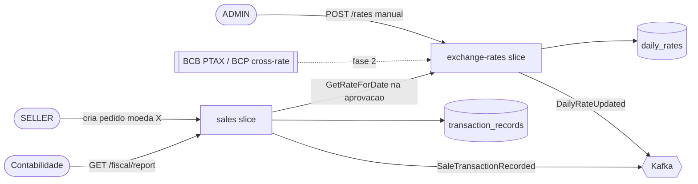
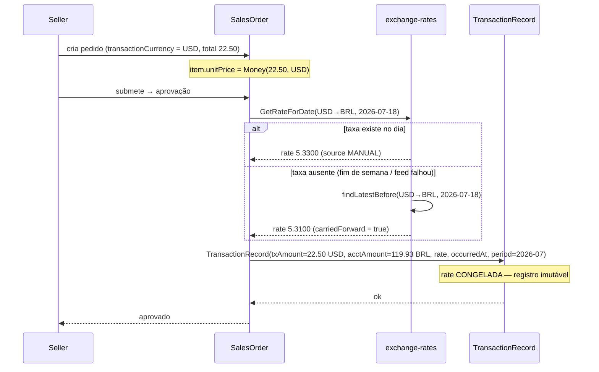
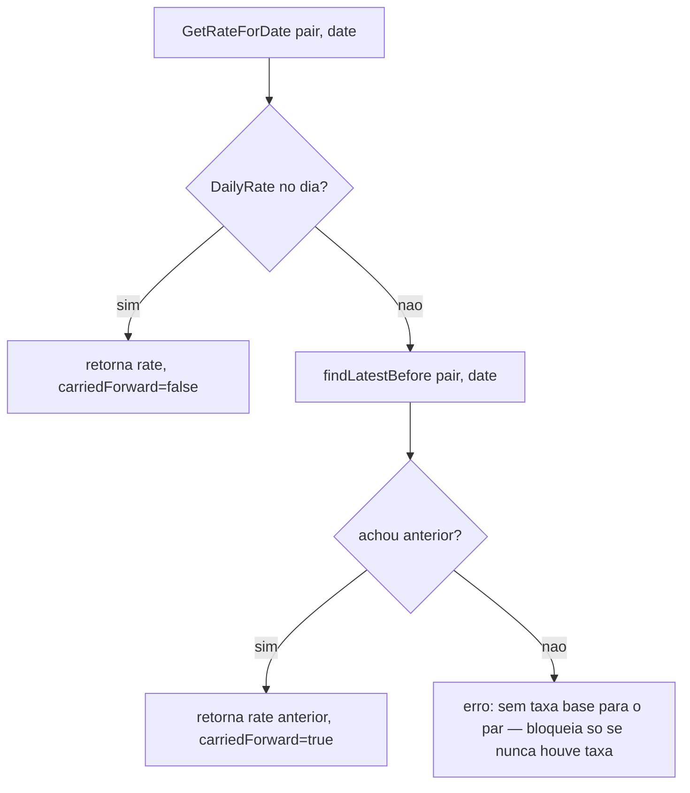

# Multi-Moeda e Gestão de Câmbio

**Status:** Draft
**Author:** George Bonespirito
**Date:** 2026-07-18
**Relacionado:** [ADR-001](../../adr/ADR-001-currency-model.md)

## Context

Vendas e compras ocorrem em BRL, PYG ou USD no mesmo dia; **BRL é a moeda contábil**. Cada transação precisa ser registrada na moeda original e no equivalente BRL (taxa do dia da transação, congelada), para compliance fiscal e para relatórios que exibam ambas as colunas. Hoje não existe dono das taxas diárias nem o registro dual-amount na implementação — só um "seletor de moeda de exibição" que não representa uma transação real.

Beneficiários: contabilidade/financeiro interno (relatório fiscal em BRL), MANAGER/ADMIN (fechamento), SELLER/PURCHASER (pedido travado em uma moeda), auditoria (histórico de câmbio).

## Scope

**In scope (esta spec, faseada — ver [Faseamento](#faseamento)):**
- Modelo de domínio: `Money`, `Currency`, `ExchangeRate`, `DailyRate`, `TransactionRecord`.
- Bounded context / vertical slice `exchange-rates`: aggregate, ports, use cases, API.
- `transactionCurrency` em `SalesOrder`/`PurchaseOrder` e criação do `TransactionRecord` dual-amount na aprovação.
- Relatório fiscal/financeiro com duas colunas (moeda da transação + BRL contábil) por período.
- Tela ADMIN de gestão de taxas diárias (entrada/override manual).

**Out of scope:**
- Implementação de código (frontend ou backend) — esta é uma spec; execução é rodada futura.
- Feed automático de câmbio (fase 2 — só a arquitetura/port fica definida aqui).
- Ganho/perda cambial realizado entre venda e recebimento (fase 3 — o modelo apenas não pode impedi-lo).
- Reavaliação cambial em fechamento contábil.

## Definitions

- **Moeda contábil (functional currency):** BRL. Toda transação é sempre registrada também em BRL. `Currency.ACCOUNTING = BRL`.
- **Moeda da transação (transaction currency):** a moeda única em que um pedido é fechado (BRL, PYG ou USD), travada na criação do pedido.
- **Preço comercial:** preço de catálogo setado por moeda, independente do câmbio (não deriva de FX). Ver [ADR-001](../../adr/ADR-001-currency-model.md) decisão 1.
- **DailyRate:** taxa de câmbio de um par de moedas em uma data específica. Uma por par por dia. Owner: context `exchange-rates`.
- **Dual-amount:** todo registro financeiro carrega `transactionAmount` (moeda original) + `accountingAmount` (BRL).
- **Rate frozen-at-date:** a taxa usada numa transação é a do dia da transação e, uma vez gravada, é imutável.
- **Par (pair):** ordenado `from→to`, ex. `USD→BRL`. Neste sistema o `to` é sempre `BRL` (moeda contábil).

## Domain Model

Reaproveita o que já está esboçado em `docs/04-frontend-angular-material.md:546-647`; abaixo só o delta e o novo aggregate.

**Value Objects (de `_shared/domain`, já especificados em `docs/04`):**
- `Money(amount: BigDecimal, currency: Currency)` — invariante `amount >= 0`; `convertTo(target, rate)`, `toAccountingCurrency(rate)`.
- `enum Currency { BRL(2), PYG(0), USD(2) }`; `ACCOUNTING = BRL`.
- `ExchangeRate(from: Currency, to: Currency, rate: BigDecimal, date: LocalDate)` — **ajuste vs `docs/04:596`: keyed por `date` (LocalDate), não `Instant`** (taxa diária, ADR-001 decisão 4).
- `TransactionRecord(transactionAmount, accountingAmount, exchangeRateUsed?, occurredAt, fiscalPeriod, type, referenceId)` — invariante `accountingAmount.currency == BRL`.

**Novo aggregate `DailyRate` (context `exchange-rates`):**

```kotlin
// exchange-rates/domain/DailyRate.kt
data class DailyRate(
    val id: DailyRateId,
    val fromCurrency: Currency,       // PYG ou USD (BRL→BRL não existe)
    val toCurrency: Currency,         // sempre BRL nesta versão
    val date: LocalDate,
    val rate: BigDecimal,             // DECIMAL(18,8) — cobre PYG→BRL ~0.00067
    val source: RateSource            // MANUAL | FEED
) {
    init {
        require(fromCurrency != Currency.BRL) { "BRL->BRL rate is identity, not stored" }
        require(rate > BigDecimal.ZERO) { "Rate must be positive" }
    }
}
enum class RateSource { MANUAL, FEED }
```

Invariante de aggregate/repositório: **no máximo um `DailyRate` por `(fromCurrency, toCurrency, date)`**. Upsert manual sobrescreve feed (source vira `MANUAL`).

## API / Contract

### Endpoints — context `exchange-rates` (`vinheria-pricing`? → **não**: serviço/slice próprio, ver [Diagramas](#c4--level-2-container))

| Method | Path | Purpose | Request Body | Response |
|---|---|---|---|---|
| GET | `/api/v1/rates?date=&pair=` | Consultar taxa de um par em uma data (aplica carry-forward) | — | `DailyRateResponse` |
| GET | `/api/v1/rates/latest` | Taxas mais recentes de todos os pares | — | `List<DailyRateResponse>` |
| POST | `/api/v1/rates` | Inserir/override manual da taxa do dia (ADMIN) | `UpsertRateRequest` | `DailyRateResponse` |

`UpsertRateRequest = { fromCurrency, toCurrency, date, rate }` · `DailyRateResponse = { fromCurrency, toCurrency, date, rate, source, carriedForward: boolean }`.

### Endpoints — relatório fiscal (context Sales/Order, reusa `docs/04:728-759`)

| Method | Path | Purpose | Response |
|---|---|---|---|
| GET | `/api/v1/fiscal/report/{period}` | Relatório do período (ex. `2026-07`), sempre em BRL + breakdown por moeda original | `FiscalReportResponse` |

`FiscalReportResponse` inclui `transactionsByOriginalCurrency: Map<Currency, CurrencyBreakdown>` onde `CurrencyBreakdown = { currency, totalOriginalAmount, totalAccountingAmount, transactionCount }` → alimenta as **duas colunas** da UI.

### Use cases

| Use case | Slice | Descrição |
|---|---|---|
| `UpsertDailyRate` | exchange-rates | Entrada/override manual (ADMIN) |
| `FetchDailyRates` | exchange-rates | Feed automático (fase 2) — popula via `RateFeedProvider` |
| `GetRateForDate(pair, date)` | exchange-rates | Lookup com carry-forward; usado pela venda |
| `RecordSaleTransaction(order)` | sales | Na aprovação, cria `TransactionRecord` dual-amount (esboço em `docs/04:652-691`) |
| `GenerateFiscalReport(period)` | sales | Agrega `TransactionRecord` do período |

### Ports (hexagonal, context `exchange-rates`)

```kotlin
interface RateRepository {                         // outbound
    fun findRate(from: Currency, to: Currency, date: LocalDate): Uni<DailyRate?>
    fun findLatestBefore(from: Currency, to: Currency, date: LocalDate): Uni<DailyRate?>  // carry-forward
    fun upsert(rate: DailyRate): Uni<DailyRate>
}
interface RateFeedProvider {                        // outbound (fase 2)
    fun fetchRates(date: LocalDate): Uni<List<DailyRate>>  // BCB PTAX (USD), cross/BCP (PYG)
}
```

### Events

| Event name | Publisher | Consumers | Payload |
|---|---|---|---|
| `vinheria.exchange-rates.daily-rate-updated` | `exchange-rates` | pricing (cache), sales (validação) | `{ fromCurrency, toCurrency, date, rate, source }` |
| `vinheria.sales.sale-transaction-recorded` | `sales` | financeiro/relatório | `TransactionRecord` |

### Schema changes

- `db/migration/Vxxx__create_daily_rates.sql` — tabela `daily_rates(from_currency, to_currency, date, rate DECIMAL(18,8), source)`, `UNIQUE(from_currency, to_currency, date)`.
- `transaction_records` — já especificada em `docs/04:696-724` (dual-amount). Ajuste: `exchange_rate_date` é `DATE` (não `TIMESTAMP`).

## Diagrams

### C4 — Level 2: Container



### Sequence: venda com dual-amount (cenário crítico)



### Flowchart: resolução de taxa (carry-forward)



## Edge cases & error handling

| Scenario | Expected behavior |
|---|---|
| **Taxa ausente na data** (fim de semana, feriado, feed falhou) | Carry-forward da última taxa útil (`findLatestBefore`), convenção PTAX; `carriedForward=true` no response. Venda **não** bloqueia. |
| **Nunca houve taxa para o par** (bootstrap) | Erro explícito 422; ADMIN precisa cadastrar a primeira taxa manual antes de vender naquela moeda. |
| **Estorno / refund** | Usa a taxa **congelada da venda original** (reverte o lançamento exato), nunca a taxa de hoje — senão fabrica ganho/perda cambial silencioso. |
| **Ganho/perda cambial** (venda vs recebimento em datas distintas) | **Fora de escopo (fase 3).** O modelo não impede: `occurredAt` no record + `TransactionType.EXCHANGE_GAIN/LOSS` (`docs/04:643-644`) já previstos. |
| **BRL como moeda da transação** | Sem conversão; `exchangeRateUsed = null`, `accountingAmount == transactionAmount`. |
| **PYG (0 decimais)** | `Money` PYG sem casas; conversão para BRL com `RoundingMode.HALF_UP`; taxa PYG→BRL em `DECIMAL(18,8)` (~0.00067). |
| **Override manual após feed** | Upsert sobrescreve, `source=MANUAL`; emite `DailyRateUpdated`. |
| **Concorrência no upsert do mesmo par/dia** | `UNIQUE(from,to,date)` + optimistic → 409; caller reenvia. |

## Security considerations

- **AuthZ:** `POST /api/v1/rates` (manual) e a tela de gestão de taxas → **apenas ADMIN**. `GET /rates` e relatório fiscal → MANAGER/ADMIN (financeiro). Sistema é fechado (só usuários internos autenticados).
- **Auditoria:** toda alteração de taxa registra autor + timestamp + `source`; `TransactionRecord` é imutável (append-only) por exigência fiscal.
- **Data classification:** valores financeiros/fiscais — internos, não públicos.

## Observability

| Signal | Implementation |
|---|---|
| Metrics | Counter `exchange_rate.upsert{source}`, `sale.transaction.recorded`; Gauge `exchange_rate.staleness_days{pair}` (dias desde a última taxa real) |
| Traces | Span em `GetRateForDate` com atributo `carriedForward`; span em `RecordSaleTransaction` |
| Logs | Estruturado `{ event: "daily_rate.updated", pair, date, rate, source, actor }` |
| Alerts | Alertar se `staleness_days > 1` em dia útil (feed parado / ADMIN esqueceu a taxa) |

## Faseamento

| Fase | Entrega | Onde |
|---|---|---|
| **1** | Modelo de domínio + rates manuais (tela ADMIN) + `transactionCurrency` no pedido + relatório 2 colunas | Frontend mock primeiro; depois backend `exchange-rates` + `sales` |
| **2** | Feed automático (BCB PTAX para USD, cross-rate/BCP para PYG) via `RateFeedProvider` + cron diário | Backend `exchange-rates` |
| **3** | Ganho/perda cambial realizado no recebimento (venda vs pagamento) | Backend `sales`/financeiro |

## Correções de docs disparadas por esta spec

- `docs/04-frontend-angular-material.md:614` — "spot rate intraday" → **taxa diária congelada na data**.
- `docs/04:596-601` — `ExchangeRate` keyed por `date: LocalDate` (não `Instant`).
- `docs/13-bounded-contexts.md` / `docs/02-arquitetura.md` — adicionar bounded context `exchange-rates` (aggregate `DailyRate`, evento `DailyRateUpdated`).
- Deprecação: modelo "display switch" (triplo `{BRL,PYG,USD}` + `CurrencyService.selectedCurrency` transacional) declarado obsoleto por [ADR-001](../../adr/ADR-001-currency-model.md).
